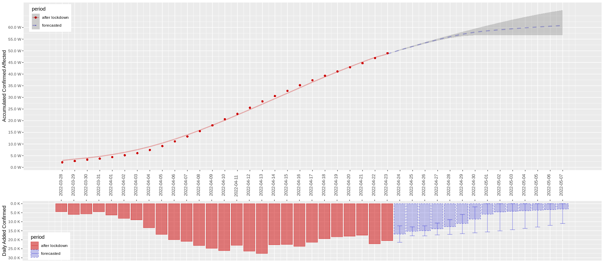
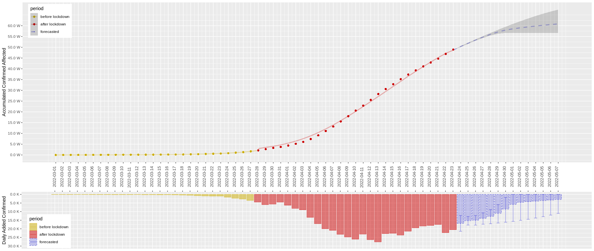
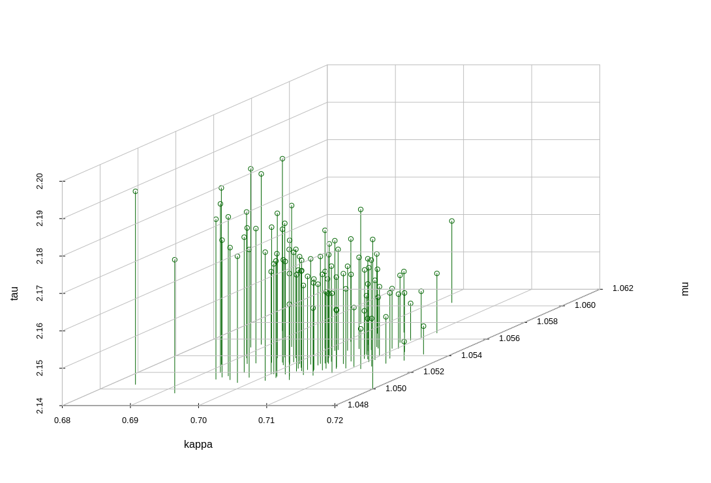

```{r setup, include=FALSE, warning=FALSE, message=FALSE}
knitr::opts_chunk$set(echo = FALSE)
library(ggplot2)
library(gridExtra)
library(tidyr)
library(scales)
blank_lines <- function(n = 10){cat(rep("&nbsp;  ",n), sep="\n")}

setwd("/home/chenzhou/Documents/DocX/WhaleDocs/Covid19/data")
options(digits = 4)
options(scipen = 0)

data_sh <- read.csv("data_0422_SH.csv")

data_sh$confirmed_add <- data_sh$inbound_confirmed + data_sh$outbound_confirmed
data_sh$asymp_add <- data_sh$inbound_asymp + data_sh$outbound_asymp
data_sh$total_add <- data_sh$confirmed_add + data_sh$asymp_add

data_sh$confirmed_acc <- cumsum(data_sh$confirmed_add) - 380
data_sh$asymp_acc <- cumsum(data_sh$asymp_add) - 120
data_sh$total_affected <- data_sh$confirmed_acc + data_sh$asymp_acc

data_sh$date <- as.Date(data_sh$date, format="%Y-%m-%d")
data_sh <- data_sh[which(data_sh$date >= "2022-03-01"),]

confirmed <- data_sh[,c("date","confirmed_add","confirmed_acc")]
confirmed$type <- "confirmed"
colnames(confirmed)  <- c("date", "add", "acc", "type")
asymp <- data_sh[,c("date","asymp_add", "asymp_acc")]
asymp$type <- "asymptomatic"
colnames(asymp)  <- c("date", "add", "acc", "type")
draw <- rbind(confirmed,asymp)

begin_date <- as.Date("2022-03-01", format="%Y-%m-%d")
term_date <- as.Date("2022-04-22", format="%Y-%m-%d")
total_trend <- ggplot() +
  geom_line(data=data_sh, aes(x=date, y=total_affected), size=1.5, alpha=.2) + geom_point(data=data_sh, aes(x=date, y=total_affected), shape=19) +
  geom_line(data=draw, aes(x=date, y=acc, color=type), size=1, alpha=.5) + geom_point(data=draw, aes(x=date, y=acc, color=type), shape=5, size=2.0) +
  scale_x_date(breaks=seq(begin_date,term_date,by="1 days"),limits=c(begin_date-1,term_date+1)) +
  scale_y_continuous(breaks=seq(0,max(data_sh$total_affected), 5e4),labels=label_number(suffix=" W",scale=1e-4)) +
  ylab("Accumulated Affected") + theme(
    legend.position = c(0.01, 0.99),
    legend.justification = c("left", "top"),
    legend.direction = "vertical",
    legend.box = "horizontal",
    axis.text.x=element_text(size=10, angle=90, hjust=-2, vjust=0),
    axis.title.x=element_blank()
  ) + ggtitle("Shanghai Accumulated Covid19 Affected")

total_add <- ggplot(data=draw, aes(x=date, y=add, color=type)) +
  geom_bar(aes(fill=type),size=0.1,position="stack",stat="identity") +
  scale_x_date(breaks=seq(begin_date,term_date,by="1 days"),position="top",limits=c(begin_date-1,term_date+1)) +
  scale_y_reverse(breaks=seq(0, 3e4, 5e3),labels=label_number(suffix=" K",scale=1e-3),limits=c(3e4,0)) +
  ylab("Daily Added Affected") +
  theme(axis.text.x=element_blank(),
        legend.position = c(0.01, 0.01),
        legend.justification = c("left", "bottom"),
        axis.title.x=element_blank())
```


```{r, results="asis"}
blank_lines(4)
```

```{r logo, echo=FALSE, out.width="20%", fig.cap="", fig.align="center"}

```

\newpage

# 上海市本轮疫情概况

自2022年2月下旬上海出现 $\text{Οmicron BA.2}$ 新冠变异毒株以来，上海乃至全国的疫情呈现出一个爆发式增长的情况。尤其在3月28日上海实施封闭式管控之后，虽然已经实施大面积排查检测、隔离防范工作，但上海市每日新增感染人数仍居高不下，其中 $90\%$ 以上为无症状感染者。$\text{Οmicron BA.2}$ 变异毒株的特性为传播速度非常快、隐匿性较强，因此给疫情防控带来了很大的难度。

Whale数据科学团队实时收集了上海市卫健委官网[@SHWJW]上公布的疫情数据，按确诊与无症状分类进行统计；境内境外数据体量差距较悬殊，且封控之后境外输入病例偶发，因此不对境内外做分桶。可对上海市感染人数（3月1日之后至今）做数据可视化如下：

```{r, echo=FALSE, fig.width=15, fig.height=10, out.width="100%", out.height="70%", fig.cap="", fig.align="center", comment="", warning=FALSE, message=FALSE}
grid.arrange(total_trend, total_add, ncol=1, heights=c(3,1))
```

上图红线代表无症状感染人数累计增长趋势，蓝线代表确诊病例累计增长趋势，灰色线代表感染人数整体增长趋势。下图红条代表单日新增无症状感染人数，蓝条代表单日新增确诊病例数量。图中可见单日新增感染人数在4月13日左右到达顶峰，随后一周出现一个整体下降的趋势。由于4月22日出现一个回升点，目前总体的走势从可视化角度上并不明朗，需要进一步建模分析。

\newpage

# 疫情模型预测结果

```{r, echo=FALSE, out.width="100%", fig.cap="", fig.align="center"}

```

上图展示了团队建立的疫情模型预测结果。预测模型参考的数据（红色）为3月28日实施全面封控之后至4月23日全上海感染总人数，包含无症状人员和确诊病例，并剔除了由无症状转为确诊重复计算的部分。蓝色虚线部分为预测效果，阴影为 $90\%$ 置信区间。关于建模过程和模型解读的其他细节将放在下一章着重介绍，这里先重点列出预测结论：

- 单日新增稳定下降至 $10000$ 例以下：4月27日 - 4月30日；
- 单日新增稳定下降至 $5000$ 例以下：5月4日之后；
- 全市范围实际感染总人数（预测至5月6日）：51万-58万；
- 全市范围社会面清零：2周之后置信区间放大，当前模型无法精准预测。

**注意，以上结论均依赖于未来的数据与建模所用数据大背景相似，即上海的社会保障体系和医疗资源能够保持较高质量输出给隔离群众，且上海市全面封控在接下来的一段时间内需继续保持高效稳定的状态。除此之外，一些无法预料的突发事件可能导致疫情趋势发生突变，这些因素暂时未被模型考虑在内。**

\newpage

# 疫情趋势建模方法

本轮疫情以来，国内多个团队尝试对疫情发展趋势建模和预测，包括上海交大、上海财大、南开大学、西安交大等团队，均给出了不同的预测结果，部分预测结论也已得到验真或验伪。目前看来，上海交大[@MGY]与西安交大[@XAJD]对拐点和峰值的预测相对准确。通过综合模型准确性、可解释性、指导价值等方面考量，我们团队考虑采用上海交大蒙国宇团队的微分方程时滞系统模型对上海市本轮疫情数据进行建模，模型定义如下：

$$
\frac{\mathrm{d}p(t)}{\mathrm{d} t} = \kappa [p(t) - \mu p(t-\tau)].
$$

其中 $p(t)$ 定义为在 $t$ 时刻感染的总人数真值；$\kappa$  为传染性指数，代表该阶段未受控感染人群单位时间的传染速度；$\mu$ 为隔离比例，代表人群确诊后能够有效隔离的比例；$\tau$ 为平均检出时间，代表从感染到确诊平均消耗的天数。

为确保模型结果客观性，我们在参数训练过程中并未使用上海交大团队的数值结论；本章将从模型结果、参数拟合、统计推断三个方面来阐释建模细节。

## 模型结果解释

```{r, echo=FALSE, out.width="100%", fig.cap="", fig.align="center"}

```

上图展示了建模结果与预测结论。其中圆点均为真值，曲线代表模型拟合值。以下列出对本次建模结果的解释，**注意，仅为模型层面的含义，并不一定是实际真实的情况。**

黄线代表3月28日上海市实施全面封控之前的模型拟合效果，吻合度极高，时滞系统参数分别为：$\kappa = 1.60, \mu = 1.17, \tau = 1.42$。意味着在全面封控执行之前，平均一个感染者一天内能够新增传染1.6个病例。隔离手段能够做到覆盖确诊病例的同时，还能多覆盖数量约为确诊病例总体17%的未确诊但已感染人群。检出时间大致为1.42天左右，也即从感染到被检出并隔离大约需要1天半。

红线代表3月28日上海市实施全面封控之后的模型拟合效果，吻合度较高，时滞系统参数分别为：$\kappa = 0.67, \mu = 1.05, \tau = 2.05$。  相比全面封控之前，由于人员流动显著减少，传播指数由1.60显著下降至0.67。由于确诊病例基数增加和隔离点趋于饱和，隔离比例系数下降至1.05，但依旧达到隔离基本要求（$\mu>1.0$）。由于大规模封控可能带来的筛查上报不及时、隔离资源吃紧等多种原因，从感染到被检出并最终有效隔离大约需要2天左右。

蓝色虚线部分代表从今日开始的总感染人数预测，由全面封控阶段（红色）模型产出。阴影部分为预测结果 $90\%$ 置信区间。从模型来看，乐观估计（下半置信区间），在4月末上海能够基本实现疫情的社会面清零；理性估计（上半置信区间），会有一定的小幅度波动将持续到5月初以及之后，从总体趋势来看能在5月底之前得到基本控制。**以上结论的大前提是未来的数据与建模所用数据大背景相似，即上海的社会保障体系和医疗资源能够保持较高质量输出给隔离群众，且上海市全面封控在接下来的一段时间内需继续保持高效稳定的状态。**

## 时滞系统参数拟合

为方便表达，我们将模型中的三个系统参数记作一个整体：$\theta = [\kappa, \mu, \tau]^T$。由于微分方程时滞系统模型一般缺乏解析解，尤其在时滞参数未确定的情况下，利用解析方式去求得系统参数估计值几乎不具备可行性[@CWB]。一种效率较低的方式是使用 $\text{Grid Search}$ 结合时滞微分方程数值解，来确定时滞系统参数的极大似然估计 $\theta_\text{MLE}$。如果考虑精度到小数点后2位，该方式将消耗超过3天计算时间，结合疫情日更新的方式，判断不可行。

这里我们考虑使用平滑逼近的想法[@EST]，即使用高维平滑基函数空间，在逼近真值解的同时，同时尽可能模拟时滞系统特性。相比传统拟合方式，我们在似然函数基础上多引入一个时滞系统特性的惩罚项：

$$
\mathcal{L}(\theta,\mathcal{C} | \{p(t)\}_{t\in \mathcal{T}}, \mathcal{B}_d, \lambda) = \sum_{t \in \mathcal{T}}\log \mathbb{P}(p(t)|\mathcal{B}_d(t)\mathcal{C}) - \lambda \int_{\mathcal{T}-\tau} \left\{ \frac{\mathrm{d}p(t)}{\mathrm{d} t} - \kappa [p(t) - \mu p(t-\tau)] \right\}^2 \mathrm{d}t.
$$

其中 $\mathcal{B}_d$ 为平滑基函数空间，我们这里选择 $\text{Bezier Spline}$ 基函数作为基函数空间；$d$为基函数空间维度，一般可以选择为拟合数据总量的一半左右；$\mathcal{C}$ 为逼近系数向量，这里可以将其视作与 $\theta$ 并列的独立参数；$\mathbb{P}(p(t)|\mathcal{B}_d(t)\mathcal{C})$ 为残差概率密度，我们这里选择高斯概率密度函数，方差权重通过正则化系数 $\lambda$ 协同控制。

由于逼近系数向量 $\mathcal{C}$ 的引入，问题可以按照如下方式进行解耦。

逐步固定 $\theta$ 求得 $\mathcal{C}$ 的相对最优解 $\widehat{\mathcal{C}}$，我们有如下性质：
$$\frac{\partial \mathcal{L}}{\partial \mathcal{C}}|_{\widehat{\mathcal{C}}} \equiv 0.$$
利用即得到：
$$
\frac{\mathrm{d}}{\mathrm{d}\theta}\frac{\partial \mathcal{L}}{\partial \mathcal{C}}|_{\widehat{\mathcal{C}}} = \frac{\partial^2\mathcal{L}}{\partial \theta \partial \mathcal{C}}|_{\widehat{\mathcal{C}}} + \frac{\partial^2\mathcal{L}}{\partial \mathcal{C}^2}|_{\widehat{\mathcal{C}}}\cdot \frac{\mathrm{d} \widehat{\mathcal{C}}}{\mathrm{d} \theta} \equiv 0.
$$
从而我们得到了残差解耦后的优化梯度：
$$
\frac{\mathrm{d} \widehat{\mathcal{C}}}{\mathrm{d} \theta} = - \left \{\frac{\partial^2\mathcal{L}}{\partial \theta \partial \mathcal{C}}|_{\widehat{\mathcal{C}}}\right \}^{-1}\left \{\frac{\partial^2\mathcal{L}}{\partial \mathcal{C}^2}|_{\widehat{\mathcal{C}}}\right \}.
$$
最后我们采用 $\text{Gauss–Newton}$ 优化法求出 $\theta$ 的局部最优解即可：
$$
\theta^{(s+1)} = \theta^{(s)} + \eta^{(s)} \left\{ \left(\mathcal{B}_d \frac{\mathrm{d} \widehat{\mathcal{C}}}{\mathrm{d} \theta}\right)^T\left(\mathcal{B}_d \frac{\mathrm{d} \widehat{\mathcal{C}}}{\mathrm{d} \theta}\right) \right \}^{-1}\left(\mathcal{B}_d \frac{\mathrm{d} \widehat{\mathcal{C}}}{\mathrm{d} \theta}\right)^T(y-\mathcal{B}_d\widehat{\mathcal{C}}).
$$

## 误差估计与推断

我们通常使用统计推断的方式为预测值估计合理的置信区间。针对上述时滞系统的拟合参数，我们可以应用 $\text{Parametric Bootstrap}$ 来进行误差估计；大致思路为，使用拟合误差作为噪声，模拟更多的真值时序，应用相同的参数拟合方式获得参数的估计值，从而获得各参数的标准差估计。我们对上海完全封控阶段的数据进行了100次模拟，获得了参数的拟合结果分布如下图：

```{r, echo=FALSE, out.width="60%", fig.cap="", fig.align="center"}

```

可以看到参数之间具备较强的相关性；各个参数的误差范围不同，但基本维持在 $1e^{-2}$ 这个尺度之内。我们也可以利用同样的方式做预测的置信区间，得到如前所述的预测区间。

\newpage

# 参考文献